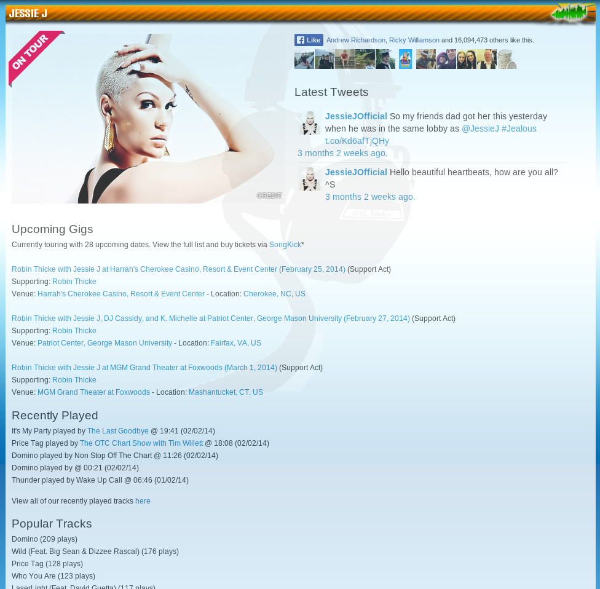
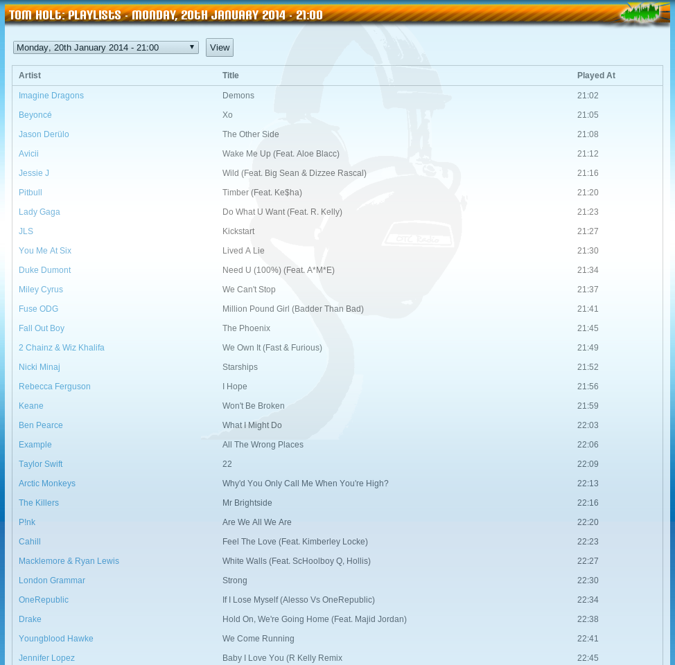
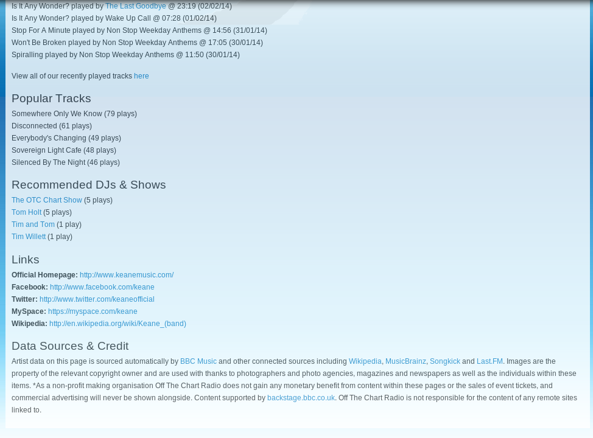
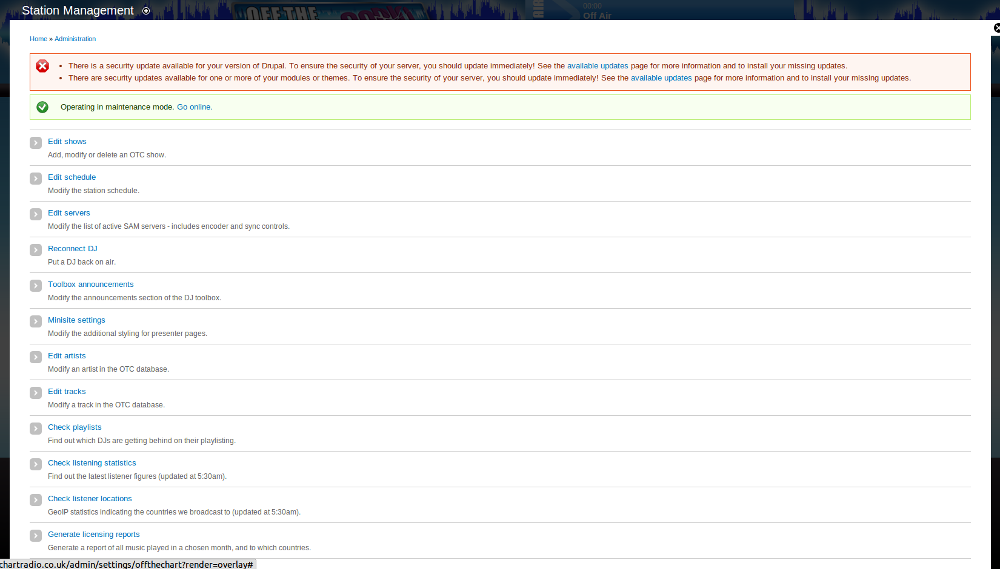
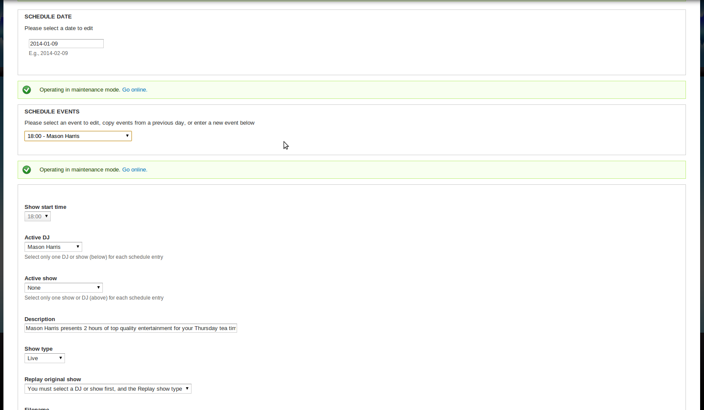
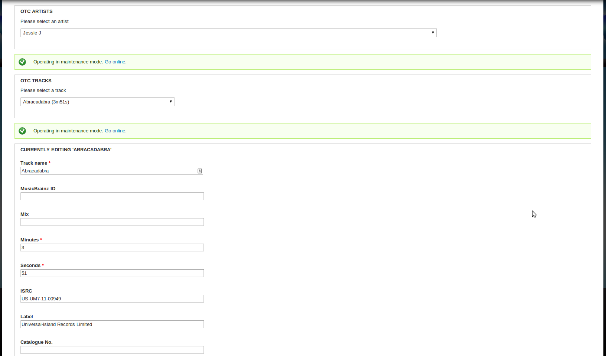

# Drupal Modules
Drupal 7.x modules for the management of a radio station and its website

## Disclaimer
The code in this repository is rather old and is unlikely to work out of the box. It is also highly likely that it suffers from security vulnerabilities.

## Background
The two modules in this repository were used to manage numerous aspects of the running of an online radio station.

### Front End
* Generates [custom pages about music and arists](http://web.archive.org/web/20130113132912/http://www.offthechartradio.co.uk:80/music/artist/Calvin%20Harris), using integrations with BBC Music, SongKick and MusicBrainz
* Lists when artists' tracks were played on the radio station and by which show(s)
* Generates [schedule pages](http://web.archive.org/web/20121226233817/http://www.offthechartradio.co.uk:80/schedule) indicating which [DJs](http://web.archive.org/web/20121226233848/http://www.offthechartradio.co.uk:80/shows) are on when
* Requires a copy of 'phpbrainz'

### Back End
* Provides a mechanism to schedule the station's shows, integrating with the playout system to load up pre-recorded content
* Provides a mechanism to capture the music played by DJs and the central playout system for music rights reporting to PPL and PRS
* Provides hooks into the station's playout system to manage encoders, reconnection of live DJs etc.
* Provides access to listening figures across various periods for music rights reporting

### Screenshots
</img> </img> </img> </img> </img> </img>

## Questions?
Feel free to create an issue. It's an awfully long time since I maintained this code however, so I can't guarantee I can remember how it works!

